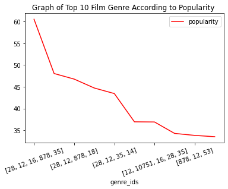

# 
Analyst: A.Omollo

Date: Nov 5, 2023

# **Summary**


This report is an analysis of the most popular films by genre (in the film industry). The analysis compares the vote count, count average, and popularity of the various genres in the film industry to rank top 10 films in their respective combinations. The analysis purposes to evaluate the top ten genres on basis of count and popularity to determine which genres are best for investments and production. It is strongly held in the analysis that genres with the most counts and popularity rates are the best to produce. The genres guarantee high return on investments for they are highly favored and watched as established in the analysis. Due to the nature of the file used in the analysis, the analysis uses a combination approach where genres are combined rather than having to analyze them as separate intenties. 
The results of the analysis deduced the following genres in their combination are the best to produce. They include '(28, 12, 16, 878, 35]', '(10751, 16, 35, 14,12]', '(28, 12, 878, 18]', '(28, 12, 878, 35]', '(28, 12, 35, 14]', '(28, 9648, 878, 53]', '(12, 10751, 16, 28,35]', '(14, 12, 878, 28]', '(878, 12, 53]', and '(12, 14, 10751]'. The results of the analysis are significant in helping Microsoft make quick-effective decisions in joining the film industry


# **KEY**


# **Problem Statement: Requirement**
Microsoft sees all the big companies creating original video content, and they want to get in on the fun. They have decided to create a new movie studio, but the problem is they don’t know anything about creating movies. They have hired you to help them better understand the movie industry. Your team is charged with exploring what type of films are currently doing the best at the box office. You must then translate those findings into actionable insights that the head of Microsoft's new movie studio can use to help decide what type of films to create.

**Business Questions**

a. **What is the most factor to consider in creating video content?** 
Genre, viewers have different tastes and preferences for different genres. Some genres attract more viewers than others. Consequently, genres with more viewers are fun to produce, earn more money, and easy to sell.Evidence is shown in the popularity, average_count, and vote_count charts.

b. **What type of genres are best to produce?** 
To consider:Genres with more popular counts, vote_count, and average_count

c. **Why do the analysis?**
Inadequate knowledge about movie creation

d. **What was the source of data?**
The file readily available from analysis.

e. **Significance to Microsoft**:
Because Microsoft is interested to create movies, it is imperative to understand the best genres to create if Microsoft is to have fun by having more viewers watching their films. This can best be depicted by univarient analysis of the genre popular counts, vote_count, and average_count

f. **What is the importance of the questions used in approaching the challenge faced by Microsoft?** 
Numbers provide a clear overview and picture of the most preferred genres in the movie industry, therefore, popular counts, vote_count, and average_count are the best factors to consider in regards to the dataset used

g. It worthwhile to note, "Vote average may be important to Microsoft's brand" (Copilot, 2020)

## **Data Understanding: The Data**
In the folder zippedData in the associated GitHub repository are movie datasets from:
Box Office Mojo
IMDB
Rotten Tomatoes
TheMovieDB.org

**Guide Questions:** What is and/or are....?

    a. Source of data and relationship between variables
    
    b. Targeted Variables: popular counts, vote_count, and average_count
    
    c. Properties of the variables: Counts

### **Checking appropriate files and Installing libraries**


```python
#Check available files
!ls
```

    Untitled.ipynb
    Untitled1.ipynb
    Untitled2.ipynb
    Untitled3.ipynb
    Untitled4.ipynb
    bom.movie_gross.csv.gz
    imdb.name.basics.csv.gz
    imdb.title.akas.csv.gz
    imdb.title.basics.csv.gz
    imdb.title.crew.csv.gz
    imdb.title.principals.csv.gz
    imdb.title.ratings.csv.gz
    mY projo.ipynb
    my project_Allan_Omollo .ipynb
    my project_Allan_Omollo.ipynb
    rt.movie_info.tsv.gz
    rt.reviews.tsv.gz
    tmdb.movies.csv.gz
    tn.movie_budgets.csv.gz
    


```python
#Impor and install libraries
import pandas as pd

import numpy as np
import seaborn as sns
import matplotlib.pyplot as plt

%matplotlib inline

```

## **Data Exploration, Preparation, and Cleaning**


```python
#Create Genre name -genre_ids Tabulated Key
genresby_id=[
    ["Action",28],
    ["Animation",12], 
    ["Comedy",16], 
    ["Crime",35], 
    ["Documentary",80], 
    ["Drama",99], 
    ["Family",19], 
    ["Fantasy",10751], 
    ["History",14], 
    ["Horror",36], 
    ["Music",27],
    ["Mystery",1042],
    ["Romance",9648],
    ["Science Fiction",878],
    ["TV Movie",10770],
    ["Thriller",53],
    ["War", 10752],
    ["Western",37]
]
GenrebyID_df=pd.DataFrame(genresby_id, columns=["Genre", "Genre_ids"])
GenrebyID_df
```


<div>
<style scoped>
    .dataframe tbody tr th:only-of-type {
        vertical-align: middle;
    }

    .dataframe tbody tr th {
        vertical-align: top;
    }

    .dataframe thead th {
        text-align: right;
    }
</style>
<table border="1" class="dataframe">
  <thead>
    <tr style="text-align: right;">
      <th></th>
      <th>Genre</th>
      <th>Genre_ids</th>
    </tr>
  </thead>
  <tbody>
    <tr>
      <th>0</th>
      <td>Action</td>
      <td>28</td>
    </tr>
    <tr>
      <th>1</th>
      <td>Animation</td>
      <td>12</td>
    </tr>
    <tr>
      <th>2</th>
      <td>Comedy</td>
      <td>16</td>
    </tr>
    <tr>
      <th>3</th>
      <td>Crime</td>
      <td>35</td>
    </tr>
    <tr>
      <th>4</th>
      <td>Documentary</td>
      <td>80</td>
    </tr>
    <tr>
      <th>5</th>
      <td>Drama</td>
      <td>99</td>
    </tr>
    <tr>
      <th>6</th>
      <td>Family</td>
      <td>19</td>
    </tr>
    <tr>
      <th>7</th>
      <td>Fantasy</td>
      <td>10751</td>
    </tr>
    <tr>
      <th>8</th>
      <td>History</td>
      <td>14</td>
    </tr>
    <tr>
      <th>9</th>
      <td>Horror</td>
      <td>36</td>
    </tr>
    <tr>
      <th>10</th>
      <td>Music</td>
      <td>27</td>
    </tr>
    <tr>
      <th>11</th>
      <td>Mystery</td>
      <td>1042</td>
    </tr>
    <tr>
      <th>12</th>
      <td>Romance</td>
      <td>9648</td>
    </tr>
    <tr>
      <th>13</th>
      <td>Science Fiction</td>
      <td>878</td>
    </tr>
    <tr>
      <th>14</th>
      <td>TV Movie</td>
      <td>10770</td>
    </tr>
    <tr>
      <th>15</th>
      <td>Thriller</td>
      <td>53</td>
    </tr>
    <tr>
      <th>16</th>
      <td>War</td>
      <td>10752</td>
    </tr>
    <tr>
      <th>17</th>
      <td>Western</td>
      <td>37</td>
    </tr>
  </tbody>
</table>
</div>


```python
df=pd.read_csv("tmdb.movies.csv.gz", index_col=0)
df
```


<div>
<style scoped>
    .dataframe tbody tr th:only-of-type {
        vertical-align: middle;
    }

    .dataframe tbody tr th {
        vertical-align: top;
    }

    .dataframe thead th {
        text-align: right;
    }
</style>
<table border="1" class="dataframe">
  <thead>
    <tr style="text-align: right;">
      <th></th>
      <th>genre_ids</th>
      <th>id</th>
      <th>original_language</th>
      <th>original_title</th>
      <th>popularity</th>
      <th>release_date</th>
      <th>title</th>
      <th>vote_average</th>
      <th>vote_count</th>
    </tr>
  </thead>
  <tbody>
    <tr>
      <th>0</th>
      <td>[12, 14, 10751]</td>
      <td>12444</td>
      <td>en</td>
      <td>Harry Potter and the Deathly Hallows: Part 1</td>
      <td>33.533</td>
      <td>2010-11-19</td>
      <td>Harry Potter and the Deathly Hallows: Part 1</td>
      <td>7.7</td>
      <td>10788</td>
    </tr>
    <tr>
      <th>1</th>
      <td>[14, 12, 16, 10751]</td>
      <td>10191</td>
      <td>en</td>
      <td>How to Train Your Dragon</td>
      <td>28.734</td>
      <td>2010-03-26</td>
      <td>How to Train Your Dragon</td>
      <td>7.7</td>
      <td>7610</td>
    </tr>
    <tr>
      <th>2</th>
      <td>[12, 28, 878]</td>
      <td>10138</td>
      <td>en</td>
      <td>Iron Man 2</td>
      <td>28.515</td>
      <td>2010-05-07</td>
      <td>Iron Man 2</td>
      <td>6.8</td>
      <td>12368</td>
    </tr>
    <tr>
      <th>3</th>
      <td>[16, 35, 10751]</td>
      <td>862</td>
      <td>en</td>
      <td>Toy Story</td>
      <td>28.005</td>
      <td>1995-11-22</td>
      <td>Toy Story</td>
      <td>7.9</td>
      <td>10174</td>
    </tr>
    <tr>
      <th>4</th>
      <td>[28, 878, 12]</td>
      <td>27205</td>
      <td>en</td>
      <td>Inception</td>
      <td>27.920</td>
      <td>2010-07-16</td>
      <td>Inception</td>
      <td>8.3</td>
      <td>22186</td>
    </tr>
    <tr>
      <th>...</th>
      <td>...</td>
      <td>...</td>
      <td>...</td>
      <td>...</td>
      <td>...</td>
      <td>...</td>
      <td>...</td>
      <td>...</td>
      <td>...</td>
    </tr>
    <tr>
      <th>26512</th>
      <td>[27, 18]</td>
      <td>488143</td>
      <td>en</td>
      <td>Laboratory Conditions</td>
      <td>0.600</td>
      <td>2018-10-13</td>
      <td>Laboratory Conditions</td>
      <td>0.0</td>
      <td>1</td>
    </tr>
    <tr>
      <th>26513</th>
      <td>[18, 53]</td>
      <td>485975</td>
      <td>en</td>
      <td>_EXHIBIT_84xxx_</td>
      <td>0.600</td>
      <td>2018-05-01</td>
      <td>_EXHIBIT_84xxx_</td>
      <td>0.0</td>
      <td>1</td>
    </tr>
    <tr>
      <th>26514</th>
      <td>[14, 28, 12]</td>
      <td>381231</td>
      <td>en</td>
      <td>The Last One</td>
      <td>0.600</td>
      <td>2018-10-01</td>
      <td>The Last One</td>
      <td>0.0</td>
      <td>1</td>
    </tr>
    <tr>
      <th>26515</th>
      <td>[10751, 12, 28]</td>
      <td>366854</td>
      <td>en</td>
      <td>Trailer Made</td>
      <td>0.600</td>
      <td>2018-06-22</td>
      <td>Trailer Made</td>
      <td>0.0</td>
      <td>1</td>
    </tr>
    <tr>
      <th>26516</th>
      <td>[53, 27]</td>
      <td>309885</td>
      <td>en</td>
      <td>The Church</td>
      <td>0.600</td>
      <td>2018-10-05</td>
      <td>The Church</td>
      <td>0.0</td>
      <td>1</td>
    </tr>
  </tbody>
</table>
<p>26517 rows × 9 columns</p>
</div>


```python
df.info()
```

    <class 'pandas.core.frame.DataFrame'>
    Int64Index: 26517 entries, 0 to 26516
    Data columns (total 9 columns):
     #   Column             Non-Null Count  Dtype  
    ---  ------             --------------  -----  
     0   genre_ids          26517 non-null  object 
     1   id                 26517 non-null  int64  
     2   original_language  26517 non-null  object 
     3   original_title     26517 non-null  object 
     4   popularity         26517 non-null  float64
     5   release_date       26517 non-null  object 
     6   title              26517 non-null  object 
     7   vote_average       26517 non-null  float64
     8   vote_count         26517 non-null  int64  
    dtypes: float64(2), int64(2), object(5)
    memory usage: 2.0+ MB
    

# Guide questions for data cleaning

a.Are there duplicated genre combinations: 

Duplicated genres combination were dropped for effective analysis. The duplicates were considered unnecessary repetition

b. Are there missing data?

No data was missing

c. Were there any variables ignored? 

Popularity, vote_count, and averge_count were used in this analysis. 

d. Were there any additional variable important for the analysis?

Language was used to guide microsoft to know which language is most preferred and widely used in movies

Popularity, vote_count, and averge_counto of genres provided high level logic for decision makingn in making movies


```python
#find duplicatedv values and drop them, focus on genre_ids
df.duplicated().sum()
```


    1020


```python
df1=df.drop_duplicates("genre_ids")
```


```python
df1.duplicated().sum()
```


    0


```python
#check for missing values
df1.isna().sum()
```


    genre_ids            0
    id                   0
    original_language    0
    original_title       0
    popularity           0
    release_date         0
    title                0
    vote_average         0
    vote_count           0
    dtype: int64


```python
#Familiarize with the clean data
df1.describe()
```


<div>
<style scoped>
    .dataframe tbody tr th:only-of-type {
        vertical-align: middle;
    }

    .dataframe tbody tr th {
        vertical-align: top;
    }

    .dataframe thead th {
        text-align: right;
    }
</style>
<table border="1" class="dataframe">
  <thead>
    <tr style="text-align: right;">
      <th></th>
      <th>id</th>
      <th>popularity</th>
      <th>vote_average</th>
      <th>vote_count</th>
    </tr>
  </thead>
  <tbody>
    <tr>
      <th>count</th>
      <td>2477.000000</td>
      <td>2477.000000</td>
      <td>2477.000000</td>
      <td>2477.000000</td>
    </tr>
    <tr>
      <th>mean</th>
      <td>234710.304804</td>
      <td>5.430405</td>
      <td>5.958942</td>
      <td>493.811465</td>
    </tr>
    <tr>
      <th>std</th>
      <td>166628.755250</td>
      <td>5.973423</td>
      <td>1.627420</td>
      <td>1587.675955</td>
    </tr>
    <tr>
      <th>min</th>
      <td>27.000000</td>
      <td>0.600000</td>
      <td>0.000000</td>
      <td>1.000000</td>
    </tr>
    <tr>
      <th>25%</th>
      <td>70091.000000</td>
      <td>1.089000</td>
      <td>5.100000</td>
      <td>4.000000</td>
    </tr>
    <tr>
      <th>50%</th>
      <td>230407.000000</td>
      <td>2.989000</td>
      <td>6.000000</td>
      <td>21.000000</td>
    </tr>
    <tr>
      <th>75%</th>
      <td>374052.000000</td>
      <td>7.974000</td>
      <td>6.900000</td>
      <td>154.000000</td>
    </tr>
    <tr>
      <th>max</th>
      <td>605434.000000</td>
      <td>60.534000</td>
      <td>10.000000</td>
      <td>22186.000000</td>
    </tr>
  </tbody>
</table>
</div>


```python
df1.dtypes
```


    genre_ids             object
    id                     int64
    original_language     object
    original_title        object
    popularity           float64
    release_date          object
    title                 object
    vote_average         float64
    vote_count             int64
    dtype: object


```python
#check on my columns to understand whoch dataset I will use for a comparison Analysis 
columns=df1.columns.tolist()
columns
```


    ['genre_ids',
     'id',
     'original_language',
     'original_title',
     'popularity',
     'release_date',
     'title',
     'vote_average',
     'vote_count']


```python
# isolate columns of choice
New_df=df1[ ['original_title','genre_ids', 'release_date','popularity','vote_average', 'vote_count', 'original_language']]
New_df
```


<div>
<style scoped>
    .dataframe tbody tr th:only-of-type {
        vertical-align: middle;
    }

    .dataframe tbody tr th {
        vertical-align: top;
    }

    .dataframe thead th {
        text-align: right;
    }
</style>
<table border="1" class="dataframe">
  <thead>
    <tr style="text-align: right;">
      <th></th>
      <th>original_title</th>
      <th>genre_ids</th>
      <th>release_date</th>
      <th>popularity</th>
      <th>vote_average</th>
      <th>vote_count</th>
      <th>original_language</th>
    </tr>
  </thead>
  <tbody>
    <tr>
      <th>0</th>
      <td>Harry Potter and the Deathly Hallows: Part 1</td>
      <td>[12, 14, 10751]</td>
      <td>2010-11-19</td>
      <td>33.533</td>
      <td>7.7</td>
      <td>10788</td>
      <td>en</td>
    </tr>
    <tr>
      <th>1</th>
      <td>How to Train Your Dragon</td>
      <td>[14, 12, 16, 10751]</td>
      <td>2010-03-26</td>
      <td>28.734</td>
      <td>7.7</td>
      <td>7610</td>
      <td>en</td>
    </tr>
    <tr>
      <th>2</th>
      <td>Iron Man 2</td>
      <td>[12, 28, 878]</td>
      <td>2010-05-07</td>
      <td>28.515</td>
      <td>6.8</td>
      <td>12368</td>
      <td>en</td>
    </tr>
    <tr>
      <th>3</th>
      <td>Toy Story</td>
      <td>[16, 35, 10751]</td>
      <td>1995-11-22</td>
      <td>28.005</td>
      <td>7.9</td>
      <td>10174</td>
      <td>en</td>
    </tr>
    <tr>
      <th>4</th>
      <td>Inception</td>
      <td>[28, 878, 12]</td>
      <td>2010-07-16</td>
      <td>27.920</td>
      <td>8.3</td>
      <td>22186</td>
      <td>en</td>
    </tr>
    <tr>
      <th>...</th>
      <td>...</td>
      <td>...</td>
      <td>...</td>
      <td>...</td>
      <td>...</td>
      <td>...</td>
      <td>...</td>
    </tr>
    <tr>
      <th>26373</th>
      <td>Ang Larawan</td>
      <td>[18, 10751, 36, 10402]</td>
      <td>2018-01-12</td>
      <td>0.600</td>
      <td>7.0</td>
      <td>2</td>
      <td>tl</td>
    </tr>
    <tr>
      <th>26415</th>
      <td>The Grave</td>
      <td>[14, 80]</td>
      <td>2018-06-03</td>
      <td>0.600</td>
      <td>6.0</td>
      <td>1</td>
      <td>en</td>
    </tr>
    <tr>
      <th>26433</th>
      <td>Muse</td>
      <td>[18, 14, 27, 878, 10749, 53]</td>
      <td>2018-09-09</td>
      <td>0.600</td>
      <td>5.7</td>
      <td>5</td>
      <td>en</td>
    </tr>
    <tr>
      <th>26452</th>
      <td>Book of the Dead</td>
      <td>[16, 27, 9648]</td>
      <td>2018-01-18</td>
      <td>0.600</td>
      <td>5.0</td>
      <td>1</td>
      <td>en</td>
    </tr>
    <tr>
      <th>26515</th>
      <td>Trailer Made</td>
      <td>[10751, 12, 28]</td>
      <td>2018-06-22</td>
      <td>0.600</td>
      <td>0.0</td>
      <td>1</td>
      <td>en</td>
    </tr>
  </tbody>
</table>
<p>2477 rows × 7 columns</p>
</div>


```python

```


```python
New_df.info()
```

    <class 'pandas.core.frame.DataFrame'>
    Int64Index: 2477 entries, 0 to 26515
    Data columns (total 7 columns):
     #   Column             Non-Null Count  Dtype  
    ---  ------             --------------  -----  
     0   original_title     2477 non-null   object 
     1   genre_ids          2477 non-null   object 
     2   release_date       2477 non-null   object 
     3   popularity         2477 non-null   float64
     4   vote_average       2477 non-null   float64
     5   vote_count         2477 non-null   int64  
     6   original_language  2477 non-null   object 
    dtypes: float64(2), int64(1), object(4)
    memory usage: 154.8+ KB
    

## Analysis and Visualization


```python
#Most popular films:What are the top 10 films by popularity
New_df_sort=New_df.sort_values( ['popularity'], ascending=False)
by_popularity=New_df_sort[ ["original_title","genre_ids","popularity"] ].head(10)
by_popularity
```


<div>
<style scoped>
    .dataframe tbody tr th:only-of-type {
        vertical-align: middle;
    }

    .dataframe tbody tr th {
        vertical-align: top;
    }

    .dataframe thead th {
        text-align: right;
    }
</style>
<table border="1" class="dataframe">
  <thead>
    <tr style="text-align: right;">
      <th></th>
      <th>original_title</th>
      <th>genre_ids</th>
      <th>popularity</th>
    </tr>
  </thead>
  <tbody>
    <tr>
      <th>23812</th>
      <td>Spider-Man: Into the Spider-Verse</td>
      <td>[28, 12, 16, 878, 35]</td>
      <td>60.534</td>
    </tr>
    <tr>
      <th>23815</th>
      <td>Ralph Breaks the Internet</td>
      <td>[10751, 16, 35, 14, 12]</td>
      <td>48.057</td>
    </tr>
    <tr>
      <th>20618</th>
      <td>Spider-Man: Homecoming</td>
      <td>[28, 12, 878, 18]</td>
      <td>46.775</td>
    </tr>
    <tr>
      <th>23816</th>
      <td>Ant-Man and the Wasp</td>
      <td>[28, 12, 878, 35]</td>
      <td>44.729</td>
    </tr>
    <tr>
      <th>20621</th>
      <td>Thor: Ragnarok</td>
      <td>[28, 12, 35, 14]</td>
      <td>43.450</td>
    </tr>
    <tr>
      <th>11023</th>
      <td>The Maze Runner</td>
      <td>[28, 9648, 878, 53]</td>
      <td>36.955</td>
    </tr>
    <tr>
      <th>11024</th>
      <td>Big Hero 6</td>
      <td>[12, 10751, 16, 28, 35]</td>
      <td>36.920</td>
    </tr>
    <tr>
      <th>20624</th>
      <td>Star Wars: The Last Jedi</td>
      <td>[14, 12, 878, 28]</td>
      <td>34.293</td>
    </tr>
    <tr>
      <th>11025</th>
      <td>The Hunger Games: Mockingjay - Part 1</td>
      <td>[878, 12, 53]</td>
      <td>33.837</td>
    </tr>
    <tr>
      <th>0</th>
      <td>Harry Potter and the Deathly Hallows: Part 1</td>
      <td>[12, 14, 10751]</td>
      <td>33.533</td>
    </tr>
  </tbody>
</table>
</div>


```python
by_popularity=New_df_sort[ ["genre_ids","popularity"] ].head(10)
by_popularity
```


<div>
<style scoped>
    .dataframe tbody tr th:only-of-type {
        vertical-align: middle;
    }

    .dataframe tbody tr th {
        vertical-align: top;
    }

    .dataframe thead th {
        text-align: right;
    }
</style>
<table border="1" class="dataframe">
  <thead>
    <tr style="text-align: right;">
      <th></th>
      <th>genre_ids</th>
      <th>popularity</th>
    </tr>
  </thead>
  <tbody>
    <tr>
      <th>23812</th>
      <td>[28, 12, 16, 878, 35]</td>
      <td>60.534</td>
    </tr>
    <tr>
      <th>23815</th>
      <td>[10751, 16, 35, 14, 12]</td>
      <td>48.057</td>
    </tr>
    <tr>
      <th>20618</th>
      <td>[28, 12, 878, 18]</td>
      <td>46.775</td>
    </tr>
    <tr>
      <th>23816</th>
      <td>[28, 12, 878, 35]</td>
      <td>44.729</td>
    </tr>
    <tr>
      <th>20621</th>
      <td>[28, 12, 35, 14]</td>
      <td>43.450</td>
    </tr>
    <tr>
      <th>11023</th>
      <td>[28, 9648, 878, 53]</td>
      <td>36.955</td>
    </tr>
    <tr>
      <th>11024</th>
      <td>[12, 10751, 16, 28, 35]</td>
      <td>36.920</td>
    </tr>
    <tr>
      <th>20624</th>
      <td>[14, 12, 878, 28]</td>
      <td>34.293</td>
    </tr>
    <tr>
      <th>11025</th>
      <td>[878, 12, 53]</td>
      <td>33.837</td>
    </tr>
    <tr>
      <th>0</th>
      <td>[12, 14, 10751]</td>
      <td>33.533</td>
    </tr>
  </tbody>
</table>
</div>


```python
genre_ids_tolist=New_df_sort["genre_ids"].head(10).tolist()
popularity_tolist=New_df_sort["popularity"].head(10).tolist()
plt.bar(
    genre_ids_tolist,
    popularity_tolist, 
    color=["red","yellow","blue","green","black","cyan","purple","orange","brown","grey"],
)
plt.title("Graph of Top 10 Film Genre According to Popularity ")
plt.xlabel("genre_ids")
plt.ylabel("popularity")

plt.show()
```


    

    


```python
by_popularity.plot.line(x="genre_ids",
                       y="popularity",
                       color=["red","yellow","blue","green","black","cyan","purple","orange","brown","grey"],
                       rot=20)
plt.title("Graph of Top 10 Film Genre According to Popularity ")
```


    Text(0.5, 1.0, 'Graph of Top 10 Film Genre According to Popularity ')


    

    


```python
by_popularity.plot.bar(x="genre_ids",
                       y="popularity",
                       color=["red","yellow","blue","green","black","cyan","purple","orange","brown","grey"],
                       rot=20)
plt.title("Graph of Top 10 Film Genre According to Popularity ")
```


    Text(0.5, 1.0, 'Graph of Top 10 Film Genre According to Popularity ')


    

    


```python

```


```python
#Most voted films:What are the top 10 films by vote_average
New_df_sort=New_df.sort_values( ['vote_average'], ascending=False)
New_df_sort[ ["original_title","genre_ids","vote_average"] ].head(10)
```


<div>
<style scoped>
    .dataframe tbody tr th:only-of-type {
        vertical-align: middle;
    }

    .dataframe tbody tr th {
        vertical-align: top;
    }

    .dataframe thead th {
        text-align: right;
    }
</style>
<table border="1" class="dataframe">
  <thead>
    <tr style="text-align: right;">
      <th></th>
      <th>original_title</th>
      <th>genre_ids</th>
      <th>vote_average</th>
    </tr>
  </thead>
  <tbody>
    <tr>
      <th>12606</th>
      <td>Today's the Day</td>
      <td>[10749, 10402]</td>
      <td>10.0</td>
    </tr>
    <tr>
      <th>15769</th>
      <td>I Am The Flash</td>
      <td>[35, 878, 28]</td>
      <td>10.0</td>
    </tr>
    <tr>
      <th>13269</th>
      <td>World War Brown</td>
      <td>[28, 35, 36, 10752]</td>
      <td>10.0</td>
    </tr>
    <tr>
      <th>19847</th>
      <td>Based On A True Story</td>
      <td>[28, 12, 35, 10749]</td>
      <td>10.0</td>
    </tr>
    <tr>
      <th>13242</th>
      <td>Watchtower of Turkey</td>
      <td>[12, 99, 10402]</td>
      <td>10.0</td>
    </tr>
    <tr>
      <th>22163</th>
      <td>Spreading Darkness</td>
      <td>[9648, 18, 35, 80, 53, 14]</td>
      <td>10.0</td>
    </tr>
    <tr>
      <th>19910</th>
      <td>Heaven is Now</td>
      <td>[53, 18, 10749, 878]</td>
      <td>10.0</td>
    </tr>
    <tr>
      <th>22250</th>
      <td>Mad About Being Mad</td>
      <td>[37, 10402, 9648, 18]</td>
      <td>10.0</td>
    </tr>
    <tr>
      <th>13239</th>
      <td>No Name: The Fastest Knitter in the West</td>
      <td>[28, 12, 35, 80, 18, 10402, 37]</td>
      <td>10.0</td>
    </tr>
    <tr>
      <th>22610</th>
      <td>Hope This Goes Over Well/Living in an Empty World</td>
      <td>[9648, 37, 18, 10402]</td>
      <td>10.0</td>
    </tr>
  </tbody>
</table>
</div>


```python
by_vote_average=New_df_sort[ ["genre_ids","vote_average"] ].head(10)
by_vote_average
```


<div>
<style scoped>
    .dataframe tbody tr th:only-of-type {
        vertical-align: middle;
    }

    .dataframe tbody tr th {
        vertical-align: top;
    }

    .dataframe thead th {
        text-align: right;
    }
</style>
<table border="1" class="dataframe">
  <thead>
    <tr style="text-align: right;">
      <th></th>
      <th>genre_ids</th>
      <th>vote_average</th>
    </tr>
  </thead>
  <tbody>
    <tr>
      <th>12606</th>
      <td>[10749, 10402]</td>
      <td>10.0</td>
    </tr>
    <tr>
      <th>15769</th>
      <td>[35, 878, 28]</td>
      <td>10.0</td>
    </tr>
    <tr>
      <th>13269</th>
      <td>[28, 35, 36, 10752]</td>
      <td>10.0</td>
    </tr>
    <tr>
      <th>19847</th>
      <td>[28, 12, 35, 10749]</td>
      <td>10.0</td>
    </tr>
    <tr>
      <th>13242</th>
      <td>[12, 99, 10402]</td>
      <td>10.0</td>
    </tr>
    <tr>
      <th>22163</th>
      <td>[9648, 18, 35, 80, 53, 14]</td>
      <td>10.0</td>
    </tr>
    <tr>
      <th>19910</th>
      <td>[53, 18, 10749, 878]</td>
      <td>10.0</td>
    </tr>
    <tr>
      <th>22250</th>
      <td>[37, 10402, 9648, 18]</td>
      <td>10.0</td>
    </tr>
    <tr>
      <th>13239</th>
      <td>[28, 12, 35, 80, 18, 10402, 37]</td>
      <td>10.0</td>
    </tr>
    <tr>
      <th>22610</th>
      <td>[9648, 37, 18, 10402]</td>
      <td>10.0</td>
    </tr>
  </tbody>
</table>
</div>


```python

```


```python
genre_ids_tolist=New_df_sort["genre_ids"].head(10).tolist()
average_vote_tolist=New_df_sort["vote_average"].head(10).tolist()
plt.bar(
    genre_ids_tolist,
    average_vote_tolist, 
    color=["red","yellow","blue","green","black","cyan","purple","orange","brown","grey"],
)
plt.title("Graph of Top 10 Film Genre According to Vote Average ")
plt.xlabel("genre_ids")
plt.ylabel("average_vote")

plt.show()
```


    

    


```python
by_vote_average.plot.bar(x="genre_ids",
                       y="vote_average",
                       color=["red","yellow","blue","green","black","cyan","purple","orange","brown","grey"],
                       rot=26)
plt.title("Graph of Top 10 Film Genre According to Vote Average ")
```


    Text(0.5, 1.0, 'Graph of Top 10 Film Genre According to Vote Average ')


    

    


```python
by_vote_average.plot.scatter(x="genre_ids",
                       y="vote_average",
                       color=["red","yellow","blue","green","black","cyan","purple","orange","brown","grey"],
                       rot=26)
plt.title("Graph of Top 10 Film Genre According to Vote Average ")
```


    Text(0.5, 1.0, 'Graph of Top 10 Film Genre According to Vote Average ')


    

    


```python

```


```python
#Most voted films:What are the top 10 films by vote_count
New_df_sort_count=New_df.sort_values( ['vote_count'], ascending=False)
New_df_sort_count[ ["original_title","genre_ids","vote_count"] ].head(10)
```


<div>
<style scoped>
    .dataframe tbody tr th:only-of-type {
        vertical-align: middle;
    }

    .dataframe tbody tr th {
        vertical-align: top;
    }

    .dataframe thead th {
        text-align: right;
    }
</style>
<table border="1" class="dataframe">
  <thead>
    <tr style="text-align: right;">
      <th></th>
      <th>original_title</th>
      <th>genre_ids</th>
      <th>vote_count</th>
    </tr>
  </thead>
  <tbody>
    <tr>
      <th>4</th>
      <td>Inception</td>
      <td>[28, 878, 12]</td>
      <td>22186</td>
    </tr>
    <tr>
      <th>6</th>
      <td>Avatar</td>
      <td>[28, 12, 14, 878]</td>
      <td>18676</td>
    </tr>
    <tr>
      <th>5235</th>
      <td>The Hunger Games</td>
      <td>[878, 12, 14]</td>
      <td>14587</td>
    </tr>
    <tr>
      <th>17437</th>
      <td>Suicide Squad</td>
      <td>[28, 12, 80, 14, 878]</td>
      <td>13533</td>
    </tr>
    <tr>
      <th>2474</th>
      <td>Captain America: The First Avenger</td>
      <td>[28, 12, 878]</td>
      <td>12810</td>
    </tr>
    <tr>
      <th>14184</th>
      <td>Inside Out</td>
      <td>[18, 35, 16, 10751]</td>
      <td>12691</td>
    </tr>
    <tr>
      <th>19</th>
      <td>Shutter Island</td>
      <td>[18, 53, 9648]</td>
      <td>12625</td>
    </tr>
    <tr>
      <th>20628</th>
      <td>Wonder Woman</td>
      <td>[12, 14, 10752, 10749]</td>
      <td>12566</td>
    </tr>
    <tr>
      <th>2</th>
      <td>Iron Man 2</td>
      <td>[12, 28, 878]</td>
      <td>12368</td>
    </tr>
    <tr>
      <th>14188</th>
      <td>The Martian</td>
      <td>[18, 12, 878]</td>
      <td>12172</td>
    </tr>
  </tbody>
</table>
</div>


```python
by_vote_count=New_df_sort_count[["genre_ids","vote_count"]].head(10)
by_vote_count
```


<div>
<style scoped>
    .dataframe tbody tr th:only-of-type {
        vertical-align: middle;
    }

    .dataframe tbody tr th {
        vertical-align: top;
    }

    .dataframe thead th {
        text-align: right;
    }
</style>
<table border="1" class="dataframe">
  <thead>
    <tr style="text-align: right;">
      <th></th>
      <th>genre_ids</th>
      <th>vote_count</th>
    </tr>
  </thead>
  <tbody>
    <tr>
      <th>4</th>
      <td>[28, 878, 12]</td>
      <td>22186</td>
    </tr>
    <tr>
      <th>6</th>
      <td>[28, 12, 14, 878]</td>
      <td>18676</td>
    </tr>
    <tr>
      <th>5235</th>
      <td>[878, 12, 14]</td>
      <td>14587</td>
    </tr>
    <tr>
      <th>17437</th>
      <td>[28, 12, 80, 14, 878]</td>
      <td>13533</td>
    </tr>
    <tr>
      <th>2474</th>
      <td>[28, 12, 878]</td>
      <td>12810</td>
    </tr>
    <tr>
      <th>14184</th>
      <td>[18, 35, 16, 10751]</td>
      <td>12691</td>
    </tr>
    <tr>
      <th>19</th>
      <td>[18, 53, 9648]</td>
      <td>12625</td>
    </tr>
    <tr>
      <th>20628</th>
      <td>[12, 14, 10752, 10749]</td>
      <td>12566</td>
    </tr>
    <tr>
      <th>2</th>
      <td>[12, 28, 878]</td>
      <td>12368</td>
    </tr>
    <tr>
      <th>14188</th>
      <td>[18, 12, 878]</td>
      <td>12172</td>
    </tr>
  </tbody>
</table>
</div>


```python
genre_ids_tolist=New_df_sort_count["genre_ids"].head(10).tolist()
count_vote_tolist=New_df_sort_count["vote_count"].head(10).tolist()
plt.bar(
    genre_ids_tolist,
    count_vote_tolist, 
    color=["red","yellow","blue","green","black","cyan","purple","orange","brown","grey"],
)
plt.title("Graph of Top 10 Film Genre According to Vote  ")
plt.xlabel("genre_ids")
plt.ylabel("count_vote")

plt.show()
```


    

    


```python
by_vote_count.plot.barh(x="genre_ids",
                       y="vote_count",
                       color=["red","yellow","blue","green","black","cyan","purple","orange","brown","grey"],
                       rot=23)
plt.title("Graph of Top 10 Film Genre According to Vote Count ")
```


    Text(0.5, 1.0, 'Graph of Top 10 Film Genre According to Vote Count ')


    

    


```python
by_vote_count.plot.area(x="genre_ids",
                       y="vote_count",
                       color=["red","yellow","blue","green","black","cyan","purple","orange","brown","grey"],
                       rot=23)
plt.title("Graph of Top 10 Film Genre According to Vote Count ")
```


    Text(0.5, 1.0, 'Graph of Top 10 Film Genre According to Vote Count ')


    

    


```python

```


```python
#What are the most spoken languages 
New_df_sort.original_language.value_counts()
#my top 10 spoken languages in film by count
language=New_df_sort.original_language.value_counts().head(10)
language
```


    en    2074
    ja      86
    fr      42
    ru      37
    es      34
    zh      33
    de      27
    hi      21
    ko      15
    cn      10
    Name: original_language, dtype: int64


```python
language=New_df_sort.original_language.value_counts().head(10)
plt.figure(figsize=(8,4))
plt.title ("Top Most Languages")
plt.xlabel("Language")
plt.ylabel("counts")
sns.boxplot(x=language.index, y=language.values)
```


    <AxesSubplot:title={'center':'Top Most Languages'}, xlabel='Language', ylabel='counts'>


    

    


```python
New_df_sort.genre_ids.unique()
```


    array(['[10749, 10402]', '[35, 878, 28]', '[28, 35, 36, 10752]', ...,
           '[53, 80, 18, 10749, 9648]', '[53, 14, 27, 10749]',
           '[10751, 12, 28]'], dtype=object)


```python

```


```python
#What are the most popular films by popularity count
popularity_count=New_df_sort.popularity.value_counts()
popularity_count

```


    0.600     331
    1.400      48
    0.840      41
    1.960       9
    0.624       6
             ... 
    5.318       1
    2.516       1
    8.053       1
    6.576       1
    14.055      1
    Name: popularity, Length: 1846, dtype: int64


```python
popularity_count=New_df_sort.popularity.value_counts().head(10)
plt.figure(figsize=(12,10))
plt.title ("Top Most Genres")
sns.barplot(x=popularity_count.index, y=popularity_count.values)
```


    <AxesSubplot:title={'center':'Top Most Genres'}>


    

    


### Analysis by Mean 


```python
New_df.describe()
```


<div>
<style scoped>
    .dataframe tbody tr th:only-of-type {
        vertical-align: middle;
    }

    .dataframe tbody tr th {
        vertical-align: top;
    }

    .dataframe thead th {
        text-align: right;
    }
</style>
<table border="1" class="dataframe">
  <thead>
    <tr style="text-align: right;">
      <th></th>
      <th>popularity</th>
      <th>vote_average</th>
      <th>vote_count</th>
    </tr>
  </thead>
  <tbody>
    <tr>
      <th>count</th>
      <td>2477.000000</td>
      <td>2477.000000</td>
      <td>2477.000000</td>
    </tr>
    <tr>
      <th>mean</th>
      <td>5.430405</td>
      <td>5.958942</td>
      <td>493.811465</td>
    </tr>
    <tr>
      <th>std</th>
      <td>5.973423</td>
      <td>1.627420</td>
      <td>1587.675955</td>
    </tr>
    <tr>
      <th>min</th>
      <td>0.600000</td>
      <td>0.000000</td>
      <td>1.000000</td>
    </tr>
    <tr>
      <th>25%</th>
      <td>1.089000</td>
      <td>5.100000</td>
      <td>4.000000</td>
    </tr>
    <tr>
      <th>50%</th>
      <td>2.989000</td>
      <td>6.000000</td>
      <td>21.000000</td>
    </tr>
    <tr>
      <th>75%</th>
      <td>7.974000</td>
      <td>6.900000</td>
      <td>154.000000</td>
    </tr>
    <tr>
      <th>max</th>
      <td>60.534000</td>
      <td>10.000000</td>
      <td>22186.000000</td>
    </tr>
  </tbody>
</table>
</div>


```python
#get the mean of columns for further analysis
New_df_sort.mean(axis="index")
```


    popularity        5.430405
    vote_average      5.958942
    vote_count      493.811465
    dtype: float64


```python

```


```python
#Top 10 rank by popularity
#Limit pass set to 30 since max is 60 and Min 0
popularity_above30=New_df_sort.loc[New_df_sort["popularity"]>30].head(10)
popularity_above30_sort=popularity_above30.sort_values(["popularity"], ascending=False)
popularity_above30_sort[ ["genre_ids","popularity"] ]
```


<div>
<style scoped>
    .dataframe tbody tr th:only-of-type {
        vertical-align: middle;
    }

    .dataframe tbody tr th {
        vertical-align: top;
    }

    .dataframe thead th {
        text-align: right;
    }
</style>
<table border="1" class="dataframe">
  <thead>
    <tr style="text-align: right;">
      <th></th>
      <th>genre_ids</th>
      <th>popularity</th>
    </tr>
  </thead>
  <tbody>
    <tr>
      <th>23812</th>
      <td>[28, 12, 16, 878, 35]</td>
      <td>60.534</td>
    </tr>
    <tr>
      <th>23815</th>
      <td>[10751, 16, 35, 14, 12]</td>
      <td>48.057</td>
    </tr>
    <tr>
      <th>20618</th>
      <td>[28, 12, 878, 18]</td>
      <td>46.775</td>
    </tr>
    <tr>
      <th>23816</th>
      <td>[28, 12, 878, 35]</td>
      <td>44.729</td>
    </tr>
    <tr>
      <th>20621</th>
      <td>[28, 12, 35, 14]</td>
      <td>43.450</td>
    </tr>
    <tr>
      <th>11023</th>
      <td>[28, 9648, 878, 53]</td>
      <td>36.955</td>
    </tr>
    <tr>
      <th>11024</th>
      <td>[12, 10751, 16, 28, 35]</td>
      <td>36.920</td>
    </tr>
    <tr>
      <th>0</th>
      <td>[12, 14, 10751]</td>
      <td>33.533</td>
    </tr>
    <tr>
      <th>11026</th>
      <td>[36, 18, 53, 10752]</td>
      <td>33.078</td>
    </tr>
    <tr>
      <th>20628</th>
      <td>[12, 14, 10752, 10749]</td>
      <td>31.618</td>
    </tr>
  </tbody>
</table>
</div>


```python
#Films above Popular Limit 30
popularity_above30_sort.plot.bar(x="genre_ids",
                       y="popularity",
                    color=["red","yellow","blue","green","black","cyan","purple","orange","brown","grey"],
                       rot=30)
plt.title("Top Genre According to 30 Mark Popularity ")
```


    Text(0.5, 1.0, 'Top Genre According to 30 Mark Popularity ')


    

    


```python
voteaverage_abovemean=New_df_sort.loc[New_df_sort["vote_average"]>5.958942].head(10)
voteaverage_abovemean_sort=voteaverage_abovemean.sort_values(["vote_average"], ascending=False)
voteaverage_abovemean_sort[ ["genre_ids","vote_average"] ]
```


<div>
<style scoped>
    .dataframe tbody tr th:only-of-type {
        vertical-align: middle;
    }

    .dataframe tbody tr th {
        vertical-align: top;
    }

    .dataframe thead th {
        text-align: right;
    }
</style>
<table border="1" class="dataframe">
  <thead>
    <tr style="text-align: right;">
      <th></th>
      <th>genre_ids</th>
      <th>vote_average</th>
    </tr>
  </thead>
  <tbody>
    <tr>
      <th>12606</th>
      <td>[10749, 10402]</td>
      <td>10.0</td>
    </tr>
    <tr>
      <th>15769</th>
      <td>[35, 878, 28]</td>
      <td>10.0</td>
    </tr>
    <tr>
      <th>13269</th>
      <td>[28, 35, 36, 10752]</td>
      <td>10.0</td>
    </tr>
    <tr>
      <th>19847</th>
      <td>[28, 12, 35, 10749]</td>
      <td>10.0</td>
    </tr>
    <tr>
      <th>13242</th>
      <td>[12, 99, 10402]</td>
      <td>10.0</td>
    </tr>
    <tr>
      <th>22163</th>
      <td>[9648, 18, 35, 80, 53, 14]</td>
      <td>10.0</td>
    </tr>
    <tr>
      <th>19910</th>
      <td>[53, 18, 10749, 878]</td>
      <td>10.0</td>
    </tr>
    <tr>
      <th>22250</th>
      <td>[37, 10402, 9648, 18]</td>
      <td>10.0</td>
    </tr>
    <tr>
      <th>13239</th>
      <td>[28, 12, 35, 80, 18, 10402, 37]</td>
      <td>10.0</td>
    </tr>
    <tr>
      <th>22610</th>
      <td>[9648, 37, 18, 10402]</td>
      <td>10.0</td>
    </tr>
  </tbody>
</table>
</div>


```python
voteaverage_abovemean_sort.plot.scatter(x="genre_ids",
                       y="popularity",
                    color=["red","yellow","blue","green","black","cyan","purple","orange","brown","grey"],
                       rot=30)
plt.title("Top 10 Genre According to Mean vote_average ")
```


    Text(0.5, 1.0, 'Top 10 Genre According to Mean vote_average ')


    

    


# **Processes of Data Analysis**
1. **How was the analysis conducted?**

A comparative analysis was conducted to isolate the best performing genres by vote average, popularity, and counts. The best ten genres were isolated based on taste and preference which was determined by highest number of vote average, popularity, and vote count. The comparative analysis took the form of a regression analysis between the selected variables vs genre_ids to get the best recommendations. 

2. **What iterations were made for better performance?**

A lot of data manipulation was done on the genre_ids to fix duplicates. Thereby, the manipulations produced a different set of dataset that made the results more significant. It turns out that dropping duplicates largely impacted results since genre_ids influenced the outcome of other variables. 

3. **Explain the significance of variables chosen in relation to the task given**

The chosen variables provided solid grounds to analyze the best genres for Microsoft to produce. It is more fun to produce films that attract the highest number of viewers. A good understanding of the genre production also helps enhance production of films that meets market needs, choices, and preferences. And therefore, enabling a company invest wisely to maximize returns on investments.


## **Analysis Evaluation**
**Describe the level of confidence in relation to results intepretation:**

In sum, the analysis is highly effective and results very confident. The analysis focused on comparing key metrics which indicated the genre types with highest numbers of votes and popularity. The results provide a solid logic for establishing a good studio and effective policies for film production. 


## **Challenges**
Limited time for analysis

## Conclusion

Microsoft should:

a.Focus on producing genres of the following combination:
    '(28, 12, 16, 878, 35]', '(10751, 16, 35, 14,12]', '(28, 12, 878, 18]'
    '(28, 12, 878, 35]', '(28, 12, 35, 14]','(28, 9648, 878, 53]', 
    '(12, 10751, 16, 28,35]', '(14, 12, 878, 28]', '(878, 12, 53]', and '(12, 14, 10751]'
    
b. Use the following languages to produce films:

English, French, Russia, and Japanese in that sequence. These languages were more viewed. Most films also produced films using these languages as seen in the analysis.

c. Microsoft should not be blinded by low points which counted more in popularity since the those films did not make to the top ten best genres and films in the industry

d. Numbers in terms of views plays a significant role in successful film production

However, there is need for more analysis. Further research is necessary to include key metrics like gross and international sales which were not included in this analysis. It is fallacious to say that most watched films earns more money although chances are high that most watched films may earn more profits. 

Therefore, given more time we can help further the analysis and provide a more comprehensive recommendation.


These genres appeared in the list of top ten genre combinations that were most voted for and therefore more popular


